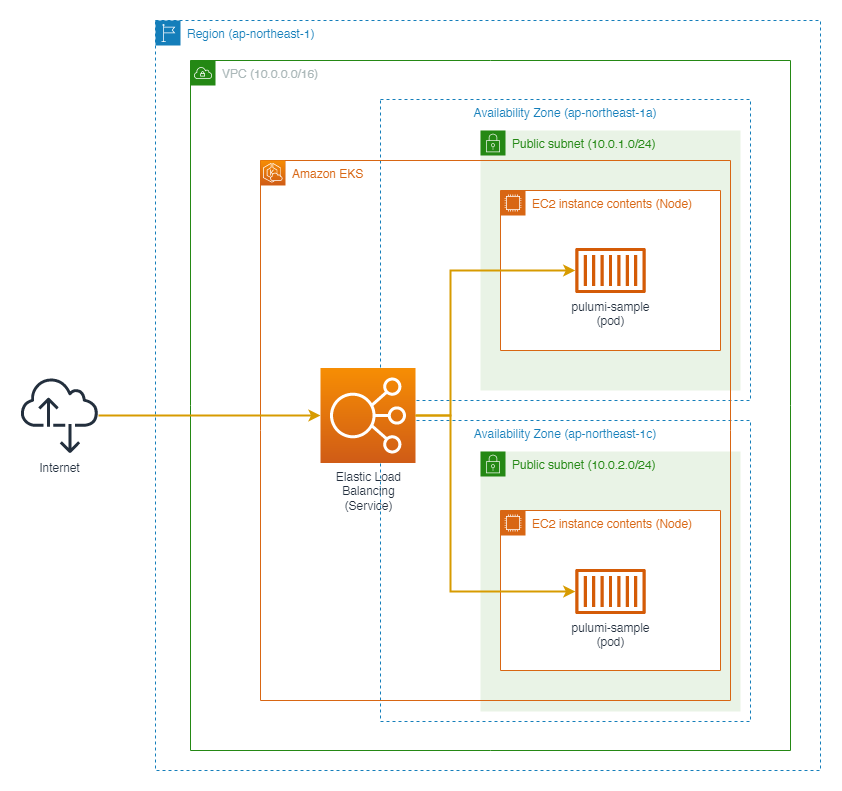

# pulumi-sample-aws-eks-cluster

EKS Cluster sample with Pulumi

## Overview



This repository has two projects.

- `aws`: aws infrastructure resources
- `kubernetes`: kubernetes manifests

If you want to deploy k8s-deployments and k8s-services, you deploy aws project first.

## Preparation

### 1. Install node.js

Install from [here](https://nodejs.org/en/download/)

### 2. Install pulumi

Install from [here](https://www.pulumi.com/docs/get-started/install/)

### 3. Install AWS CLI

Install from [here](https://docs.aws.amazon.com/cli/latest/userguide/getting-started-install.html)

### 4. Set AWS profile

```console
$ aws configure --profile pulumi-sample
AWS Access Key ID [None]: **********************
AWS Secret Access Key [None]: ******************************
Default region name [None]: ap-northeast-1
Default output format [None]: json
```

## Author

[warawara28](https://github.com/warawara28)
